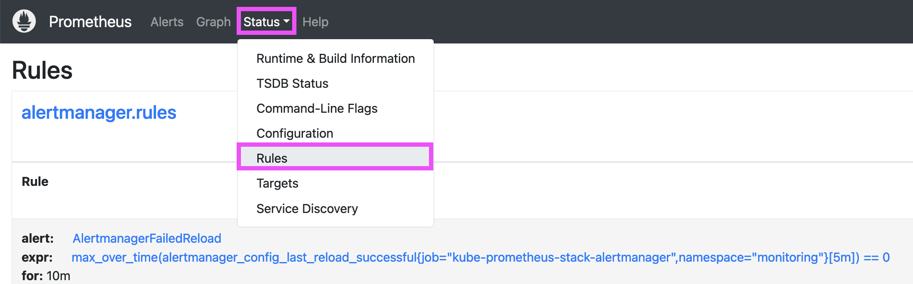
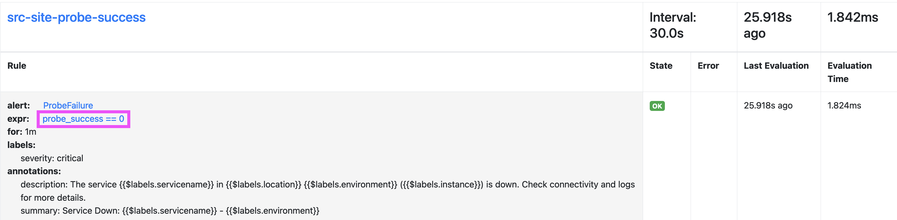
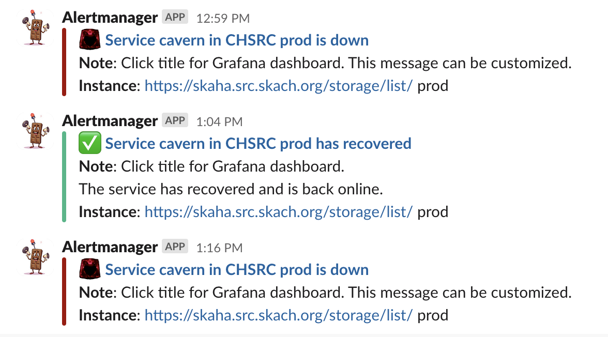
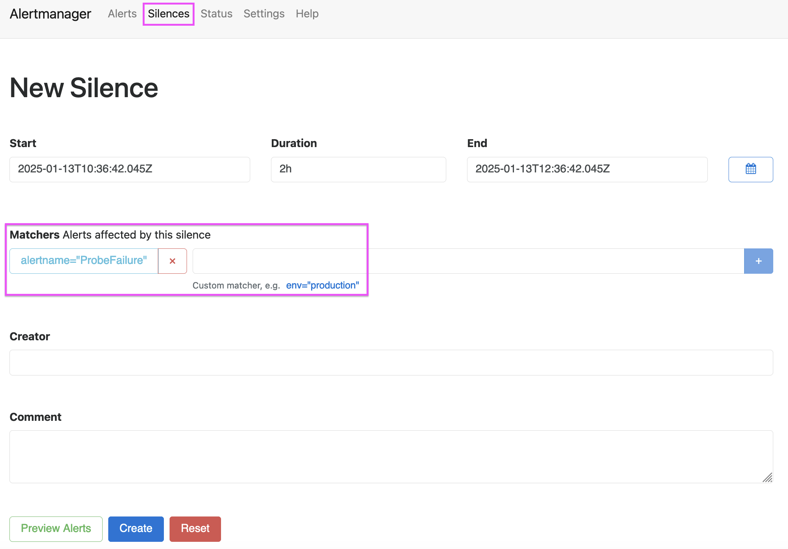
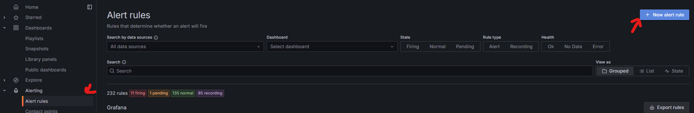
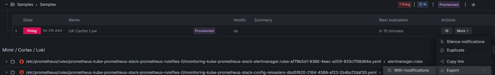
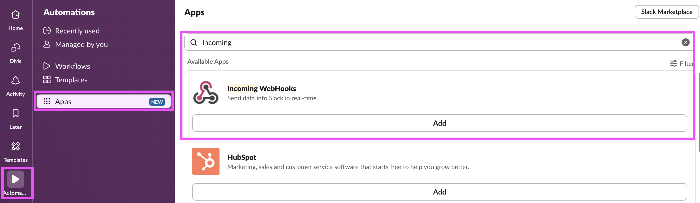
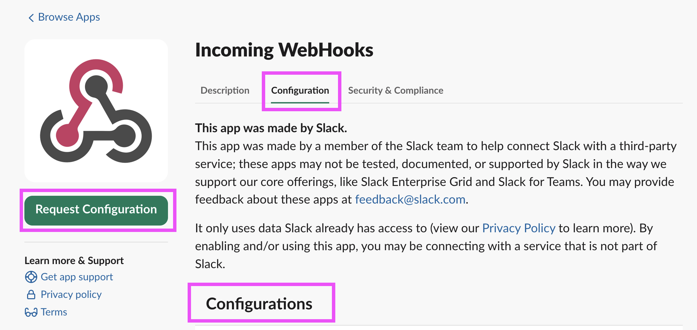
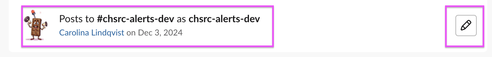

# Alerting
This page describes the current alerting setup for CHSRC.

[TOC]

# Alertmanager alerts
This section describes how to create an Alertmanager alert for a Prometheus
metric and sending the alerts to Slack.

{: style="width:40%;" .shadow; align=right}

## Adding a new alert with notifications
Adding a new alert and sending notifications to a Slack channel requires some
configuration both in Prometheus and in Alertmanager.

### Prometheus configuration
To add a new alert, you need to decide which metric and which value it will react
on. The alerts are added to the Prometheus configuration as [alerting rules](https://prometheus.io/docs/prometheus/latest/configuration/alerting_rules/)
under `additionalPrometheusRulesMap` in the `values.yaml` found [here](https://gitlab.com/ska-telescope/src/deployments/chsrc/ska-src-chsrc-services-cd/-/blob/dev/apps/kube-prometheus-stack/base/values.yaml).

To ensure that the alert is being picked up by the Prometheus configuration you
can see the Rules section in the Prometheus web interface.

The rule section will reflect the configuration that has been set up. It is also
possible to debug the rule using the Prometheus query editor to check whether
there are values that would trigger the rule or not. Click the expression in the
rule to open it in the query editor and trigger a query.

### Alertmanager configuration
When the alert is added to Prometheus, you can set up routing for this alert in
alertmanager. This is configured in the `alertmanager.config.route` section. The
routing can route an alert that matches specific labels to a specific receiver.
The receiver is set up in the `alertmanager.config.receivers` section. In the
receiver you can customize where the alert will be sent (e.g. a slack channel),
which credentials to use, and the layout of the message that will be sent.

See the documentation for more details and settings for routing and receivers:

- [Routing configuration](https://prometheus.io/docs/alerting/latest/configuration/#route-related-settings)  
- [Receiver configuration](https://prometheus.io/docs/alerting/latest/configuration/#general-receiver-related-settings)

!!! Tip "Routing alerts"
    Note that the same alert can be routed to multiple slack channels, for
    example, a national channel and a shared SRCNet channel. This is helpful for
    sharing or filtering the alerts as needed.

The alerts can be customized to contain links to dashboards, emojis, links to
documentation for how to resolve a type of alert, etc. It is also possible to
send a customized message when the alerting metric has recovered.

#### Silencing an alert
When debugging, it can be useful to silence an alert. This can be done in the
Alertmanager web interface by filtering which alerts to silence
and creating a Silence. It is time-limited and any alerts will resume when the
Silence expires.

# Grafana alerts
This section describes how to create an alert for Grafana
metrics and sending those alerts to Slack. Grafana alerts allow for more complex alert rules and
potentially the creation of a scheduled status overview directly to slack.

## Adding a new alert
While it is possible to leverage the chsrc gitops to directly add an alert as code only,
it is recommended to use the grafana frontend to create the alert and then export it.

Creating a new alert (or *alert rule*, to be percise) is done in the Alert rules section.

After going through the form (make sure to select the correct contact point) and saving the new rule
the rule or the full set of rules can be exported. The latter is easier to make sure nothing existing is overwritten.
The exported rules can then be added to the `grafana-alerts.yaml`.

The alerts should now be automatically synced through ArgoCD and automatically provisioned in case grafana is redeployed.

## Editing or updating an existing alert
ArgoCD provisioned alerts cannot be directly edited. Instead the alert can be exported with modifications (see image)

This will open a form that allows for changed to be made prior to an export.
The exported yaml can then be used to overwrite the original settings in the above mentioned `grafana-alerts.yaml` file.

## Silencing an alert
When debugging, it can be useful to silence an alert. This can be done in the
Grafana web interface by either finding an alerting rule that needs to be silenced in the `Alert rules` section
or by opening the `Silences` (dev)](https://grafana.dev.skach.org/alerting/silences) (prod)](https://grafana.src.skach.org/alerting/silences) section and filtering to silence multiple alerts at once for a specified duration.

# Configuring Slack integration
The Slack integration is set up using an Incoming Webhook that is defined in the
Slack instance itself in Automations -> Apps -> Incoming Webhooks.

Adding a new webhook generates a URL that is stored as a secret in Vault
(apps/alertmanager). The secret is mounted in the alertmanager instance and referred to using
`alertmanager.config.global.slack_api_url_file`.

## Editing an existing webhook
The existing webhook can be edited in the Incoming Webhooks configuration menu.

## How to regenerate the slack-api-url
!!! Tip "Ownership of the webhook"
    Note that only the owner of the webhook can edit it and manage the Slack API
    URL link, as well as the channel to which the alert is sent. This is not
    transferrable. If the ownership needs to be moved, it is necessary to create
    a new webhook and update the slack-api-url secret accordingly in Vault.

You can list all the webhooks in the slack instance, but only the ones you own
are editable. The `slack-api-url` can be regenerated when you edit the webhook.
If it is regenerated, the old link will stop working and alerts will not be sent
until the credential has been updated in Vault and Alertmanager has picked up
the changed secret.

